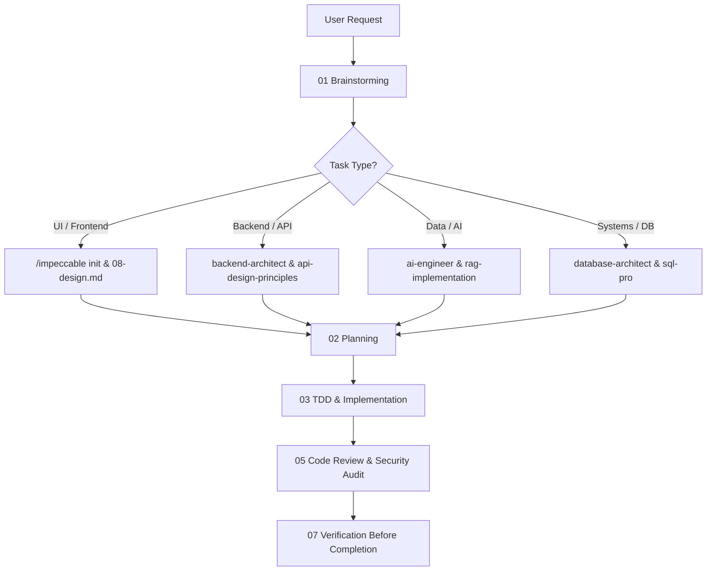

# 00 — AI Master Skill Catalog & Capability Matrix

Purpose: The single comprehensive reference and index for AI coding agents. It maps every phase of the software engineering lifecycle, integrates the full Impeccable design suite, and catalogs specialized engineering skills so the agent always knows exactly which workflow, slash command, or domain capability to invoke.

---

## 1. Core Lifecycle Workflow Skills

Every task follows this disciplined, non-negotiable loop:

| Stage | Module | Trigger / Situation | Primary Deliverable / Rule |
|---|---|---|---|
| **00** | `00-master-skills-catalog.md` | Session start, routing uncertainty, capability lookup | Complete capability overview & routing matrix |
| **01** | `01-brainstorming.md` | Starting any new feature, behavior change, or spike | Task classification (Spike/Bounded/Architectural) & approved design |
| **02** | `02-planning.md` | Design is approved; task breakdown needed | Sequenced, independently verifiable task list |
| **03** | `03-tdd.md` | Writing any implementation or fix code | **Iron Law:** No production code without a failing test first |
| **04** | `04-debugging.md` | Any bug, test failure, or unexpected behavior | **Iron Law:** No fix without root cause investigation first |
| **05** | `05-code-review.md` | Task or PR ready for review | Severity-ranked review (Critical, Important, Minor) |
| **06** | `06-git-workflow.md` | Starting parallel work or finishing branch | Isolated branches/worktrees, atomic commits |
| **07** | `07-verification.md` | About to declare completion | Proof over claims: tests ran, repro verified, spec checked |
| **08** | `08-design.md` | Building or reshaping any visible UI | Non-generic design plan, tokens, accessibility floor |
| **09** | `09-extending.md` | Adding recurring patterns or modules | Safe module addition without breaking the router |

---

## 2. Impeccable Design & Frontend Suite

For any user-facing surface (web apps, landing pages, dashboards, mobile UI, component systems), integrate the **Impeccable** design command suite directly into Phase 08 (`08-design.md`):

### Core Initialization & Context
- **`/impeccable init`** (or `node .agent/skills/impeccable/scripts/context.mjs`):
  - **Mandatory first step for UI work.**
  - Scans codebase, interviews for product truth, and produces `PRODUCT.md` (users, purpose, positioning, constraints, stack).
  - Must run before any visual decisions or code are written.
- **`/impeccable document`**:
  - Reverse-engineers an existing UI codebase and generates `DESIGN.md` (colors, typography, components, layout rhythm).

### Planning & Discovery
- **`/impeccable shape <feature>`**:
  - Plans UX and screen flows before touching UI code.
  - Generates surface briefs and task-level interaction concepts.

### Extraction & System Building
- **`/impeccable extract <target>`**:
  - Extracts ad-hoc inline styles and values into clean, reusable design tokens and shared components.

### Quality, Auditing & Evaluation
- **`/impeccable critique <target>`**:
  - Deep UX review with heuristic scoring, cognitive load assessment, and visual hierarchy feedback.
- **`/impeccable audit <target>`**:
  - Automated & manual check against the non-negotiable quality floor: WCAG 2.2 contrast/focus, responsive behavior, touch targets, and performance.
- **`/impeccable doctor`**:
  - Inspects and repairs drift between `PRODUCT.md`, `DESIGN.md`, tokens, and active source files.

### Refinement & Aesthetic Calibration
- **`/impeccable polish <target>`**:
  - Final craftsmanship pass to remove AI clichés, fix micro-spacing, and tighten visual cohesion.
- **`/impeccable bolder <target>`**:
  - Injects distinct personality, stronger typography, and visual signatures into timid, generic designs.
- **`/impeccable quieter <target>`**:
  - Softens aggressive, overstimulating, or cluttered interfaces.
- **`/impeccable distill <target>`**:
  - Strips UI to its functional essence, eliminating unnecessary chrome.
- **`/impeccable harden <target>`**:
  - Adds robust empty states, loading skeletons, error boundaries, and edge-case handling.

### Live Iteration
- **`/impeccable live`**:
  - Visual variant mode directly connected to the running browser for real-time element tuning.

---

## 3. Specialized Domain Engineering Skills

When a task requires deep domain expertise, combine the master workflow with these specialized skills:

### Domain Catalog:

1. **Architecture & Systems**:
   - `architecture-patterns`: Clean Architecture, Hexagonal, DDD.
   - `backend-architect`: Scalable API design, microservices, gRPC/REST.
   - `api-design-principles`: RESTful and GraphQL schema design standards.
2. **AI & Machine Learning**:
   - `ai-engineer`: LLM application patterns, agent orchestration, tool routing.
   - `rag-implementation`: Vector embeddings, semantic search, hybrid retrieval.
   - `prompt-engineer`: Systematic prompt optimization, few-shot prompting, evaluations.
3. **Frontend & Mobile**:
   - `impeccable`: Design director-level craft, token systems, UI audit.
   - `nextjs-app-router-patterns`: React Server Components, streaming, App Router conventions.
   - `react-state-management`: Zustand, Redux Toolkit, React Query.
   - `tailwind-design-system`: Custom Tailwind design token architectures.
4. **Data & Storage**:
   - `database-architect`: Relational & NoSQL schema design, normalization, indexing.
   - `database-optimizer`: Query tuning, execution plan analysis, index optimization.
   - `database-migration`: Zero-downtime migrations, rollback safety.
   - `sql-pro`: Advanced SQL queries, window functions, OLAP/OLTP workloads.
5. **Security & Compliance**:
   - `backend-security-coder`: AuthN/AuthZ, input sanitization, OWASP Top 10 mitigation.
   - `frontend-security-coder`: XSS prevention, CSP, client-side secret leakage prevention.
   - `security-auditor`: Comprehensive vulnerability scanning and threat modeling.
   - `wcag-audit-patterns`: WCAG 2.2 AA/AAA accessibility compliance.
6. **Testing & QA**:
   - `unit-testing-test-generate`: High-coverage unit test suites.
   - `e2e-testing-patterns`: Playwright/Cypress end-to-end testing.
   - `test-automator`: Self-healing CI/CD test pipelines.

---

## 4. Priority Rules & Conflict Resolution

1. **Iron Laws Override All Else**:
   - Never write production code without a failing test first (`03-tdd.md`).
   - Never apply a fix without root cause investigation first (`04-debugging.md`).
2. **Design Gate Precedes Code**:
   - Never scaffold projects or write code until the user approves the design proposal (`01-brainstorming.md`).
3. **UI Gate Order**:
   - Brainstorming → `/impeccable init` (`PRODUCT.md`) → Planning → Design (`08-design.md` / `DESIGN.md`) → TDD.
4. **Project Overrides Global**:
   - Project-local rules in `CLAUDE.md`, `AGENTS.md`, or `GEMINI.md` supersede generic patterns.
5. **Proof Precedes Claims**:
   - Never report "fixed" or "complete" without executing real verification checks (`07-verification.md`).
